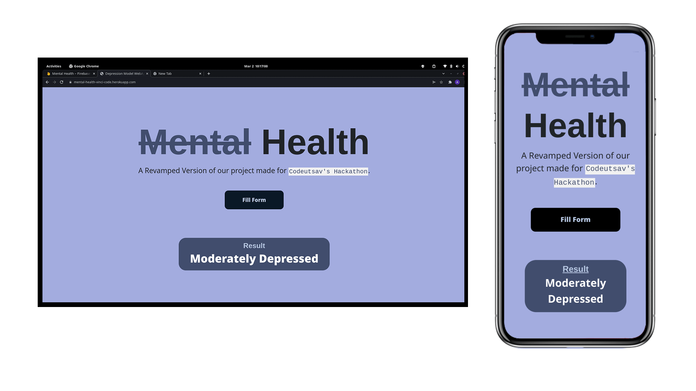
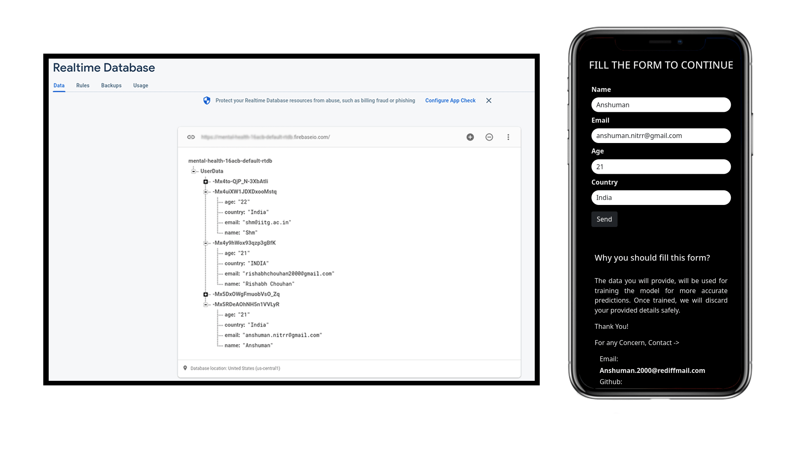
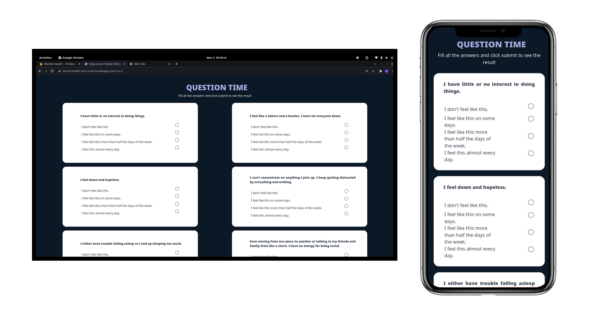

<p align="center">
  <a>
    <h1 align="center">Mental Health - Team Vinci Code</h1>
    <p align="center">A Depression Detection WebApp using <a href="https://scikit-learn.org/stable/">Sklearn</a> and <a href="https://flask.palletsprojects.com/en/2.0.x/">Flask</a></p>
  </a>
</p>

<div align="center">

[](https://www.python.org/)
[](https://gunicorn.org/)
[](https://flask.palletsprojects.com/en/2.0.x/)
[](https://developer.mozilla.org/en-US/docs/Web/JavaScript)
[](https://scikit-learn.org/stable/)    
[](https://www.w3schools.com/python/pandas/default.asp)
[](https://firebase.google.com/?gclid=CjwKCAiAjoeRBhAJEiwAYY3nDB14zlhMZWk1DwLCUqBAe2-NluQew_fKtIZEzNfYav_C-MzRxPDOPhoC-RUQAvD_BwE&gclsrc=aw.ds)

    
</div>

<div style="text-align: justify">
    
To create an informative AI-based tool that should be able to give alerts and identify cases of mental health issues in children and also track the improvement status in identified cases. It should be able to track mental health issues prevalent in children from birth to the ones which they acquired later in their life for remediation and counselling. The tool should support teacher’s assessment as well as parental and self-assessment.
    
</div>



<p align="center">
  <a>
    <h1 align="left">Firebase Integration</h1>
    <p align="left">All the data collected through form is stored in Realtime Database of Firebase. The Firebase Realtime Database is a cloud-hosted NoSQL database that lets you store and sync data between your users in realtime.</p>
  </a>
</p>



> Based on your Answers, it will show the extent of your depression. 




# Documentation

## Installing

Go to your project directory and create a virtual env to run flask app:

```sh
$ cd myproject
$ python3 -m venv venv
```
Activate your virtual env :

```sh
$ . venv/bin/activate
```
Within the activated environment, use the following command to install Flask:

```sh
$ pip install Flask
```
To run the application, use the flask command or python -m flask. Before you can do that you need to tell your terminal the application to work with by exporting the FLASK_APP environment variable:

```sh
$ export FLASK_APP=app
$ flask run
 * Running on http://127.0.0.1:5000/
```
